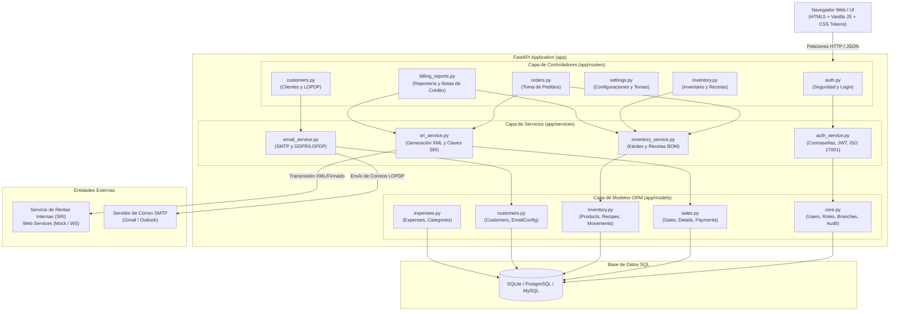
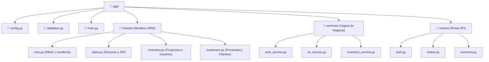
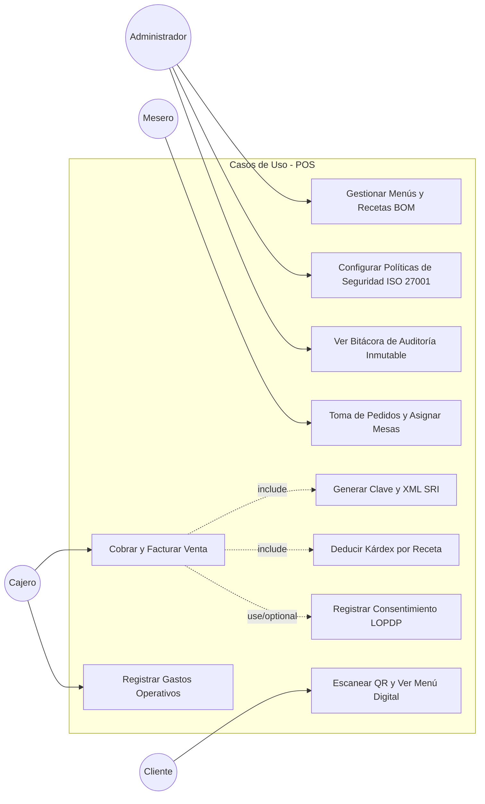
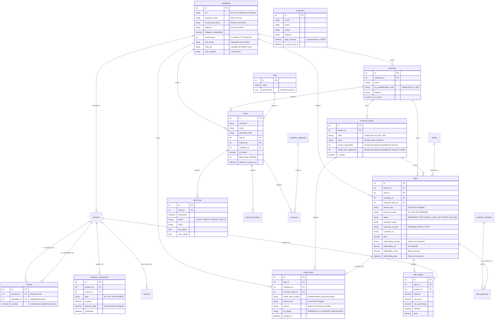

# Documentación Técnica - POS v2.0
## Sistema de Gestión de Sistema POS y Facturación Electrónica (SRI Ecuador)

Esta documentación técnica sirve como guía de referencia central para ingenieros de software de cualquier nivel que necesiten leer, mantener o extender el código de **POS**. Cubre la arquitectura, base de datos, flujos de negocio clave (SRI, Kárdex/Recetas) y lineamientos para desarrollo.

---

## 1. Arquitectura y Componentes del Sistema

POS está estructurado como una aplicación monolitica con diseño modular en capas utilizando **FastAPI** para la API web y servicios, y **SQLAlchemy** como el mapeador objeto-relacional (ORM) para interactuar de forma transparente con bases de datos SQL.

### 1.1 Diagrama de Componentes (Mermaid)

El siguiente diagrama detalla cómo fluyen las peticiones de los usuarios a través del sistema, cómo interactúa la lógica del negocio, la capa de persistencia y las integraciones externas:



---

## 2. Diagrama de Módulos (Estructura de Carpetas)

La estructura física del código fuente sigue una organización por responsabilidades:

- `/app/config.py`: Centraliza variables de entorno y define los *Design Tokens* estéticos (colores, fuentes) para la UI dinámica.
- `/app/database.py`: Define el ciclo de vida de la conexión y sesión (`get_db`).
- `/app/models/`: Contiene los modelos SQL estructurados en SQLAlchemy Declarative.
- `/app/routers/`: Maneja los endpoints HTTP y el despacho de las plantillas HTML para la interfaz.
- `/app/services/`: Lógica pesada desacoplada del framework web.
- `/app/templates/`: Vistas de usuario renderizadas con HTML clásico.
- `/app/static/`: Hojas de estilo CSS (`index.css` de variables estéticas del tema) e imágenes del sistema.



---

## 3. Casos de Uso del Negocio

El sistema tiene cuatro actores principales que interactúan en la operación diaria de la cafetería:



---

## 4. Estructura de la Base de Datos (Modelo Entidad-Relación)

A continuación se muestra el diagrama ERD generado a partir de las declaraciones de SQLAlchemy. Define la integridad referencial y las dependencias de datos del sistema:



---

## 5. Reglas de Negocio Clave y Flujo del Código

### 5.1 Flujo de Facturación Electrónica SRI (Ecuador)
Cuando se procesa una venta en `/sales/`, el sistema interactúa con [SRIService](file:///c:/applications/app_pos/app/services/sri_service.py). El flujo técnico es:

1. **Gestión Multiempresa (Multi-tenant) y Multipunto**:
   La cabecera de la venta (`Sale`) almacena la referencia a la empresa (`company_id`) y al punto de emisión (`emission_point_id`) seleccionados. Los datos fiscales (RUC, razón social, dirección matriz, ambiente) y la identidad de marca (personalidad, colores, logo) son recuperados dinámicamente del modelo `Company` almacenado en la base de datos, en lugar de estar fijos en variables `.env`.
2. **Generación de Secuenciales Strict**:
   El secuencial de la factura (`invoice_number`) se genera a partir del punto de emisión activo: `establecimiento - punto_emision - secuencial`. El secuencial se incrementa de forma secuencial y atómica por transacción de venta en el backend.
3. **Determinación Dinámica de IVA por Periodos**:
   El porcentaje de impuesto se obtiene dinámicamente de la tabla `tax_parameters` basado en la fecha de la venta (`sale_date`). El backend realiza una consulta para encontrar el parámetro de IVA activo y vigente para ese tramo de tiempo, permitiendo regularizaciones gubernamentales del SRI sin alterar la base histórica.
4. **Generación de la Clave de Acceso (49 dígitos)**:
   Se construye concatenando la fecha de emisión, código de factura ("01"), RUC de la empresa (13 dígitos), ambiente de la empresa ("1" o "2"), serie de emisión ("Establecimiento + Punto Emisión", e.g., "001001"), secuencial (9 dígitos), código numérico aleatorio (8 dígitos) y tipo de emisión ("1").
5. **Cálculo de Chequeador Módulo 11**:
   La función `_calculate_modulo11` aplica factores de multiplicación repetidos del 2 al 7 a cada dígito de derecha a izquierda. La suma de estos productos se divide por 11, y se resta el residuo a 11.
   *Fórmula matemática*:
   $$\text{Suma} = \sum_{i=1}^{N} d_i \times f_i$$
   $$\text{Residuo} = \text{Suma} \pmod{11}$$
   $$\text{Verificador} = 11 - \text{Residuo}$$ (Si el resultado es 11 $\rightarrow 0$; si es 10 $\rightarrow 1$).
6. **Esquema XML**:
   Se compila un documento XML cumpliendo el esquema estándar de la ficha técnica SRI (v1.1.0). El código de porcentaje de IVA se asocia de forma dinámica (e.g., 2 para 12%, 4 para 15% según el estándar ecuatoriano).
7. **Firma XAdES-BES**:
   El método `sign_xml` provee la estructura inicial (Mock) para integrar firma mediante certificados electrónicos `.p12` cargados desde la base de datos de la empresa.

### 5.2 Descuento Automático de Inventario (BOM / Recetas)
La función clave es [InventoryService.process_sale_inventory_deduction](file:///c:/applications/app_pos/app/services/inventory_service.py#L65-L111):
- Para cada producto vendido, el sistema realiza una consulta a la tabla `recipes`.
- Si se encuentra una receta (ej. Capuchino): el sistema itera sobre cada insumo (leche, café) y descuenta del Kárdex la cantidad proporcional calculada:
  $$\text{Cantidad a Descontar} = \text{Cantidad de Insumo por Unidad} \times \text{Cantidad de Producto Vendida}$$
- Si no hay receta, el sistema registra una salida directa del producto principal.
- Cada movimiento actualiza el campo de auditoría rápida `balance_after` calculando el saldo acumulado en tiempo real.

### 5.3 Control de Acceso y Trazabilidad (ISO 27001)
El módulo de autenticación [auth_service.py](file:///c:/applications/app_pos/app/services/auth_service.py) aplica rigurosos controles de ciberseguridad basados en la norma **ISO 27001 (Dominio A.9 y A.12)**:
- **A.9.2.4**: Las contraseñas se cifran usando *bcrypt* con un costo computacional de factor 12.
- **A.9.4.2**: Bloqueo temporal automático del usuario (duración configurable, por defecto 30 minutos) al acumular 5 intentos fallidos consecutivos de inicio de sesión.
- **A.9.4.3**: Complejidad mínima exigida (mayúsculas, números, símbolos y longitud de caracteres) y memoria histórica para evitar reutilizar las últimas 5 contraseñas.
- **A.12.4.1**: Cada acción que altere el estado o requiera seguridad (login, fallos de login, inserción de facturas, etc.) genera una fila en `AuditLog` persistiendo los valores anteriores y nuevos para auditorías forenses inmutables.

### 5.4 Gestión de Retenciones, Anulación y Reportería SRI
El sistema provee una gestión fiscal robusta adaptada al SRI de Ecuador:
- **Pagos con Retenciones**: Al registrar facturas, se capturan los detalles del comprobante físico de retención de IVA/Renta emitido por el cliente. El pago neto se calcula de forma automática deduciendo las retenciones, y se registra un pago contable compensatorio bajo el método "Retención" para asegurar el balance de la venta.
- **Anulación con Notas de Crédito**: Para dar de baja facturas autorizadas, el sistema genera automáticamente un comprobante electrónico de Nota de Crédito (código "04"), consume un secuencial dedicado del punto de emisión y calcula su clave de acceso SRI correspondiente.
- **Reversión Automática de Stock**: La anulación llama al servicio Kárdex para identificar los consumos originales por receta (BOM) o venta directa y emite movimientos de entrada (`IN`) compensatorios para reponer existencias en tiempo real.
- **Reportes y Anexo ATS**: El módulo consolida bases gravables por tarifa de IVA, desglosa comprobantes de retención recibidos y agrupa métricas por tipos de identificación del cliente (Cédula, RUC, CF) y códigos de pago oficiales del SRI para facilitar la declaración contable.

---

## 6. Guía Práctica de Desarrollo (Onboarding)

### 6.1 Cómo levantar el entorno local de desarrollo

1. **Instalar dependencias**:
   Asegúrate de contar con Python 3.10+ y ejecuta en tu terminal:
   ```bash
   pip install -r requirements.txt
   ```
2. **Configuración de Variables de Entorno**:
   Copia el archivo `.env.example` como `.env` y edita las credenciales:
   - Cambia `DB_ENGINE` a `sqlite`, `postgresql` o `mysql` según tu preferencia.
   - Ajusta `BRAND_NAME` y tokens de identidad gráfica para cambiar el aspecto visual de la UI.
3. **Iniciar la Base de Datos**:
   El sistema creará las tablas automáticamente al inicializar la aplicación. Para sembrar datos iniciales o crear el esquema, puedes correr el servidor por primera vez.
4. **Levantar el Servidor**:
   Puedes hacer clic en el archivo por lotes `iniciar_app.bat` o ejecutar el comando:
   ```bash
   uvicorn app.main:app --reload --port 8000
   ```
   Accede a la UI interactiva de desarrollo en [http://127.0.0.1:8000/docs](http://127.0.0.1:8000/docs).

### 6.2 Cómo agregar un nuevo Router (Endpoint)

1. Crea un nuevo archivo en `app/routers/` (ej: `app/routers/promotions.py`):
   ```python
   from fastapi import APIRouter, Depends
   from sqlalchemy.orm import Session
   from ..database import get_db

   router = APIRouter(prefix="/api/promotions", tags=["Promociones"])

   @router.get("/")
   def list_promotions(db: Session = Depends(get_db)):
       return {"promos": []}
   ```
2. Registra el router en [app/main.py](file:///c:/applications/app_pos/app/main.py):
   ```python
   from .routers import promotions as promotions_router
   # ...
   app.include_router(promotions_router.router)
   ```

### 6.3 Cómo agregar un nuevo Modelo (Tabla)

1. Define tu clase SQLAlchemy en el archivo de módulo pertinente dentro de `app/models/` (ej. en `app/models/operations.py`):
   ```python
   from sqlalchemy.orm import Mapped, mapped_column
   from .core import Base

   class Promotion(Base):
       __tablename__ = "promotions"
       id: Mapped[int] = mapped_column(primary_key=True)
       code: Mapped[str] = mapped_column(unique=True, nullable=False)
       discount_percent: Mapped[float] = mapped_column(default=0.0)
   ```
2. Importa el modelo en `app/main.py` para asegurar que SQLAlchemy lo registre al inicializar:
   ```python
   from .models.operations import Promotion
   ```
3. Si usas PostgreSQL o MySQL en producción, ejecuta las migraciones de Alembic correspondientes para impactar la base de datos de destino.
